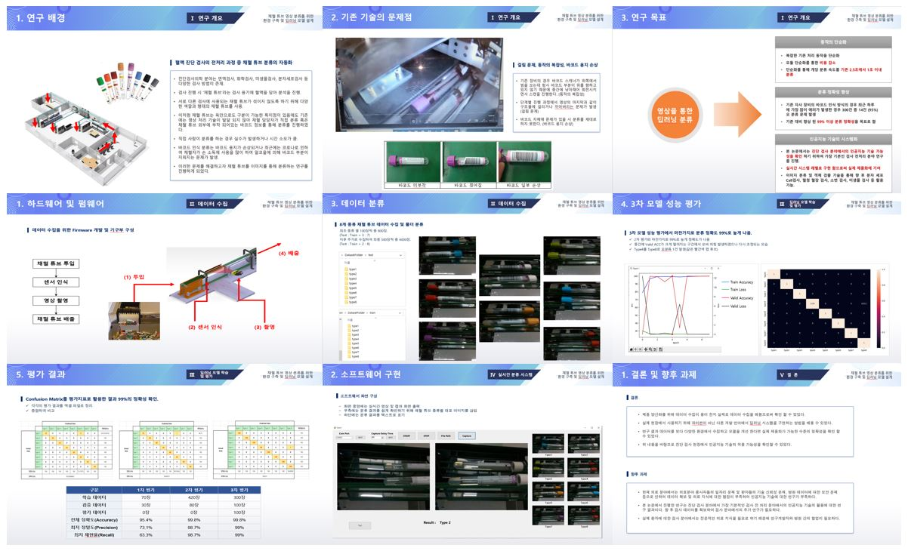

# **채혈 튜브 이미지 분류 프로젝트 📖**

 
 

## 📝 프로젝트 내용 요약
- 진단검사 분야에서 사용되는 혈액관은 검사 부위별로 다양한 색상과 모양을 가지고 있어 채혈 및 검사 담당자가 육안으로 쉽게 구분할 수 있다.
- 이러한 시각적 특성에도 불구하고 진단검사 분야에서 사용되는 대부분의 검사장비는 영상처리 기반의 분류기술이 발달되기 이전에 개발되었다.
- 검사자의 직접 분류나 부착된 바코드를 인식하는 방식으로 기존에는 진행하지만 시간적 소모나 기술적 문제가 있다. 
- 문제를 해결하고자 첫번째로 다양한 채혈 튜브 영상 데이터를 쉽고 빠르게 수집할 수 있는 환경을 구축하였다.
- 두번째로 수집된 채혈 튜브 영상 데이터를 EfficientNet 모델을 통해 학습하여 채혈 튜브 분류에 최적화 된 딥러닝 모델을 만들었다. 
- 실제 현장에서 동작 할 수 있도록 C#언어 기반 소프트웨어에 딥러닝 모델을 구현하기 위하여 ONNX로 딥러닝 모델을 변환하고 소프트웨어에 적용하여 실시간 분류를 진행하였다. 

 

## 📌 프로젝트 결과 요약
- 시간당 1000개의 영상 데이터 획득이 가능.
- EfficientNet 모델을 통해 분류한 결과 분류 정확도는 99.8%로 기존 대비 높은 정확성. 
- 400개의 샘플을 사용한 실시간 테스트 결과는 9개의 이미지 캡처 오류와 16개의 분류 실패. 
- 이미지 캡처 오류가 있는 정확도는 93.75%, 이미지 캡처 오류가 없는 정확도는 95.91%로 최종 확인.

 

## 📂 프로젝트 작성 코드

**- `변환코드` : [Pytorch 모델을 ONNX 모델로 변환하는 코드](./ExportONNX)**

 

**- `변환코드2` : [Pytorch 모델을 ONNX 모델로 변환하는 코드2](./ExportONNX2)**

 

**- `모델 학습 코드` : [EfficientNet을 이용하여 데이터 학습 및 검증, 결과 Visualizaion 출력 파이썬 코드](./FinalProject)**

 

**- `실시간 분류 동작 코드` : [장비를 동작하여 실시간으로 채혈 튜브를 분류하는 C# 기반 프로그램 코드](./SortingTest)**

 

**- `데이터셋` : [프로젝트 수행에 사용한 실제 채혈 튜브 데이터셋](./myBigData)**

 
