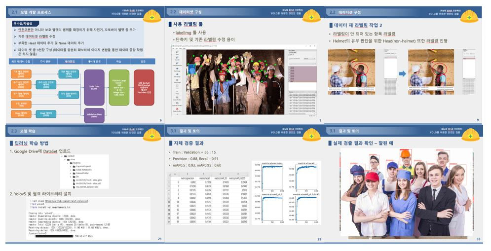
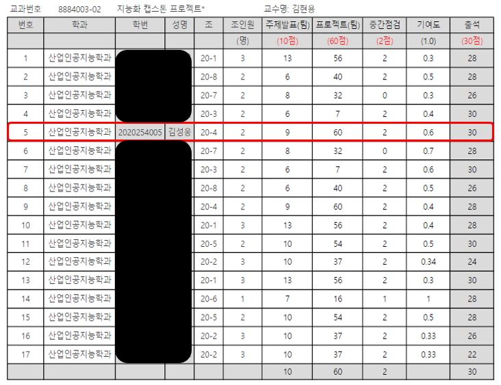
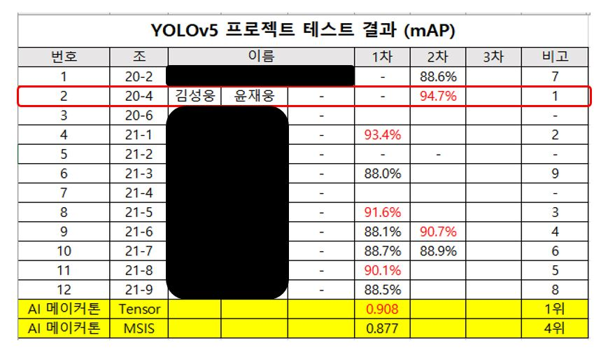

# **채혈 튜브 이미지 분류 프로젝트 📖**

 
 

## 📝 프로젝트 내용 요약
- 객체 검출에 가장 많이 사용되는 Yolo 모델 중 가장 최신 모델인 v5모델을 사용하여 객체 검출 프로젝트를 진행.
- 산업 현장에서 안전모의 중요성을 부각 시키기 위해 안전모를 착용하지 않은 객체를 검출.
- 양질의 데이터셋구성에 초점을 맞추었으며 데이터 재라벨링, 해
- 문제를 해결하고자 첫번째로 다양한 채혈 튜브 영상 데이터를 쉽고 빠르게 수집할 수 있는 환경을 구축하였다.
- 두번째로 수집된 채혈 튜브 영상 데이터를 EfficientNet 모델을 통해 학습하여 채혈 튜브 분류에 최적화 된 딥러닝 모델을 만들었다. 
- 실제 현장에서 동작 할 수 있도록 C#언어 기반 소프트웨어에 딥러닝 모델을 구현하기 위하여 ONNX로 딥러닝 모델을 변환하고 소프트웨어에 적용하여 실시간 분류를 진행하였다. 

 

## 📌 프로젝트 결과 요약
- 시간당 1000개의 영상 데이터 획득이 가능.
- EfficientNet 모델을 통해 분류한 결과 분류 정확도는 99.8%로 기존 대비 높은 정확성. 
- 400개의 샘플을 사용한 실시간 테스트 결과는 9개의 이미지 캡처 오류와 16개의 분류 실패. 
- 이미지 캡처 오류가 있는 정확도는 93.75%, 이미지 캡처 오류가 없는 정확도는 95.91%로 최종 확인.

 

## 📂 프로젝트 작성 코드

**- `Colab Code & yaml` : [Colab Pro를 사용한 코드 및 Yaml파일](./1.%20Colab코드%20및%20yaml파일)**

 

**- `Test 이미지 피드백자료` : [검증 결과에 대한 검출 결과 및 그래프](./2.%20Test이미지%20피드백자료)**

 

**- `xml-txt 변환 코드` : [xml 형식의 라벨링 결과를 txt형식으로 변환하는 코드](./3.%20xml-txt변환코드)**

 

**- `발표자료` : [최종 발표자료 PPT 파일]**

 

### 최종 검출률 94.7% 학과 내 1등 

 

 
