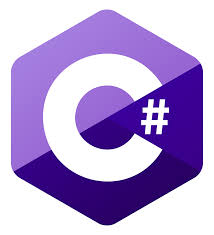

# **김성웅(KIM-SEONG-WOONG)**
## Introduce

  

* (주)한랩 미래기술연구소 연구원
* 충북대학교 산업인공지능학과 석사과정
* 이메일 : [style8903@naver.com](mailto:style8903@naver.com)

-------------------------

## Development Language

  

 

### 재학생 수행 프로젝트

- `2020-10` [어프렌티스 프로젝트](https://github.com/style8903/industrial-AI/tree/master/projects/어프렌티스-프로젝트): 문제해결방법론 교육 및 프로젝트 준비
- `2020-10` [산업 컴퓨터비전 실제](https://github.com/style8903/industrial-AI/tree/master/projects/산업-컴퓨터비전-실제): OpenCV를 활용한 영상 개선, 영상 분할, 객체 검출/추적 구현 

### AI 관련 프로그래밍

- `2020-10` [기계학습](https://github.com/style8903/industrial-AI/tree/master/programming/기계학습): PCA, SVM, HMM 등 기계학습 관련 알고리즘 구현
- `2020-10` [네트워크-통신](https://github.com/style8903/industrial-AI/tree/master/programming/네트워크-통신): IoT 관련 네트워크 프로그래밍
- `2020-10` [딥러닝](https://github.com/style8903/industrial-AI/tree/master/programming/딥러닝): MLP, CNN, RNN 등 딥러닝 활용 프로그래밍
- `2020-10` [빅데이터분석](https://github.com/style8903/industrial-AI/tree/master/programming/빅데이터분석): 빅데이터 분석 알고리즘 구현

### GitHub 교육

- `2020-10` [GitHub이용및포트폴리오작성자료](https://github.com/Bessesian/industrial-AI/tree/master/Education): 포트폴리오 관리 자료

### 재학생 포트폴리오 현황

- `2020-11` [재학생이름](GitHub link): 재학생 GitHub 포트폴리오 주소

