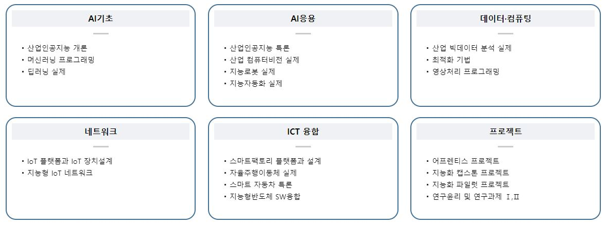
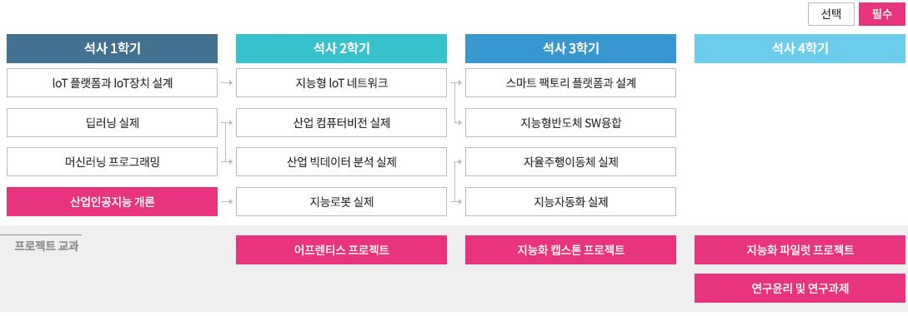

# **🏫 충북대학교 산업인공지능학과(Industry A.I)**

[홈페이지 바로가기](https://indai.cbnu.ac.kr/)
 
 

## [산업인공지능] 교육과목 ✏

- `2020-10` [어프렌티스 프로젝트](https://github.com/style8903/industrial-AI/tree/master/Subjects/어프렌티스-프로젝트): 문제해결방법론 교육 및 프로젝트 준비.
- `2020-10` [산업 컴퓨터비전 실제](https://github.com/style8903/industrial-AI/tree/master/Subjects/산업-컴퓨터비전-실제): OpenCV를 활용한 영상 개선, 영상 분할, 객체 검출/추적 구현.
- `2021-03` [딥러닝실제](https://github.com/style8903/industrial-AI/tree/master/Subjects/딥러닝실제): 파이썬 및 텐서플로를 활용한 신경회로망 및 딥러닝 구현.
- `2021-03` [산업인공지능 개론](https://github.com/style8903/industrial-AI/tree/master/Subjects/산업인공지능-개론): 인공지능의 주요 기술 개념 및 알고리즘 학습. 파이썬 실습.
- `2021-10` [산업 빅데이터 분석 실제](https://github.com/style8903/industrial-AI/tree/master/Subjects/산업-빅데이터-분석-실제): 딥러닝 모델 개발을 위한 데이터 수집 및 데이터 분석, 전처리 방법에 대하여 학습.
- `2021-10` [지능화 파일럿 프로젝트](https://github.com/style8903/industrial-AI/tree/master/Subjects/지능화-파일럿-프로젝트): 그동안 학습 했던 내용을 바탕으로 실제 현장에서 발생하는 문제를 해결하기 위하여 스스로 프로젝트를 진행.

 

## 프로그래밍 자료 🖥

- `2022-03` [딥러닝 연습](https://github.com/style8903/industrial-AI/tree/master/industrial-AI/Projects/Deeplearning-Practice): 딥러닝 이해를 위한 개인 실습.
- `2022-06` [채혈튜브 분류 프로젝트](https://github.com/style8903/industrial-AI/tree/master/industrial-AI/Projects/Blood-Tube-Classification): 병원에서 사용하는 채혈 튜브 이미지 데이터를 이용하여 Classification 프로젝트를 진행.

