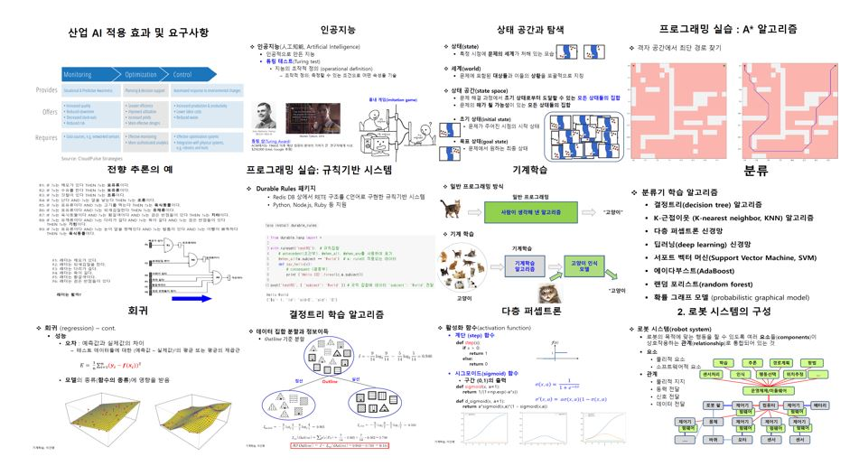
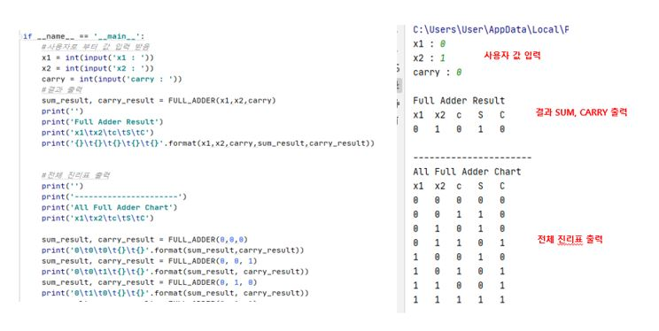
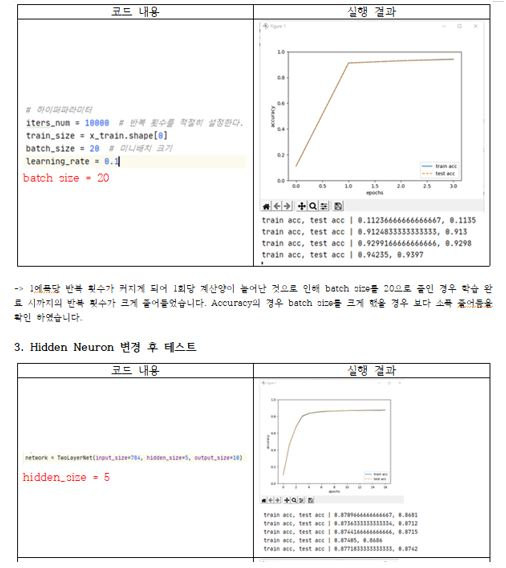
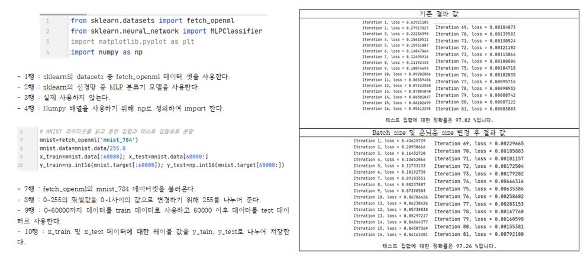
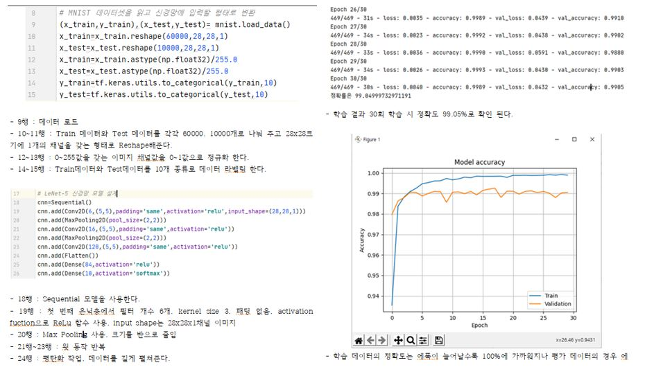

# **딥러닝 실제 📖**

 
 

## 📝 강의개요 
- 인공지능시스템의 기본이 되는 신경회로망 및 딥러닝에 대해서 배운다. 특히 파이썬과 텐서플로우를 이용한 구현 실습을 병행한다.

 

## 📌 학습목표 
- 파이썬과 텐서플로우를 이용한 딥러닝 시스템의 구현

 

## 📂 과목 진행 내용 

**- `3주차 과제` : 딥러닝 응용 현황에 관한 시장 조사**

 

**- `4주차 과제` : [기본 영상 입출력 실습](./4주차%20과제-화면출력)**

 

**- `5주차 과제` : [AND, OR, NAND, XOR 함수를 응용하여 전가산기 함수를 구현 ](./5주차%20과제-Full_Adder)**

 

**- `6주차 과제` : 신경회로망의 역사에 대한 학습**

 

**- `9주차 과제` : [TwoLayerNet을 실습하고 batch-size, hidden-size 파라미터를 변경하여 결과 비교 ](./9주차%20과제)**

 

**- `11주차 과제` : [sklearn의 mnist 데이터셋을 MLP 분류기를 사용하여 실습하고 결과를 확인 ](./11주차%20과제)**

 

**- `13주차 과제` : [ 실제 딥러닝 모델을 직접 구현하고 MNIST 데이터셋을 사용하여 결과를 확인 ](./13주차%20과제)**

 
