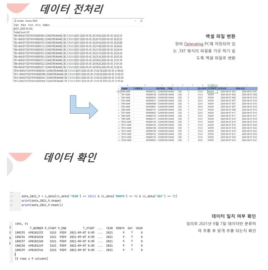

# **산업 빅데이터 분석 실제 📖**

 
 

## 📝 강의개요 
- 데이터 분석은 대량의 데이터에 숨겨져 있는 의미있는 정보를 추출하는 기법으로 빅데이터 시대에 중요한 분석 기술이다.
- 데이터 분석에서 사용되는 분류, 연관규칙, 군집화, 시각화에 관련된 주요 알고리즘을 소개하고 적용 방법을 학습한다.

 

## 📌 학습목표 
- 데이터 분석 및 시각화 과정의 이해
- 널리 사용되는 데이터 분석 및 시각화 방법의 핵심 아이디어의 이해
- 데이터 분석 및 시각화 분석 도구를 활용하는 경험
- 빅데이터와 기계학습에 관련된 주요 이슈의 이해

 

## 📂 과목 진행 내용 

**- `연습코드` : [다양한 빅데이터 분석 관련 파이썬 실습 코드 정리](./연습코드)**

 

**- `Mid-Project` : [환자 데이터를 이용하여 데이터셋 확인 및 전처리](./Mid-Project)**

 

 

**- `Final-Project` : [환자 데이터를 이용하여 탐색적 데이터 분석 및 회귀 분석](./Final-Project)**

 

