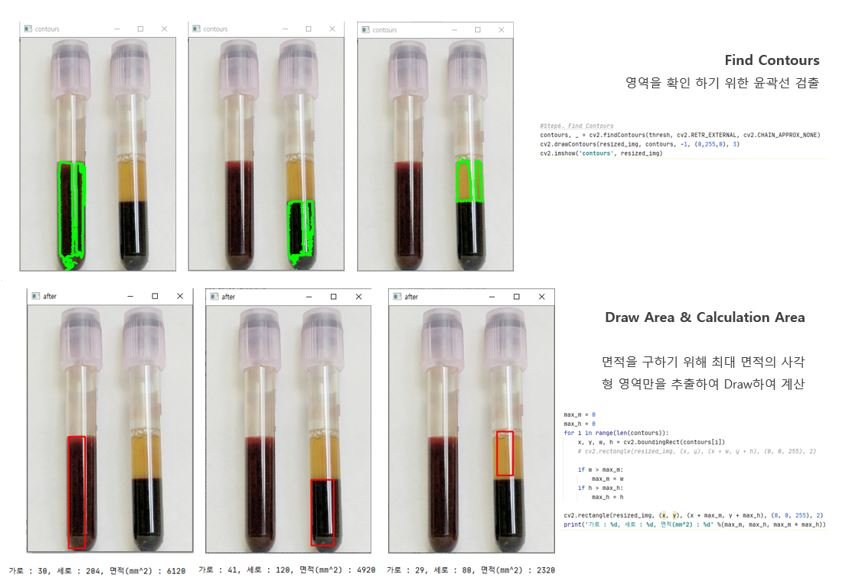

# **산업 컴퓨터 비전 📖**

 
 

## 📝 강의개요 
- 실제 산업현장에서 사용이 가능한 컴퓨터 비전 기술에 대해서 배우며, 파이썬 프로그래밍을 통해 학습한다.
- OpenCV 라이브러리를 이용해서 영상을 열고, 필터링 하고, 기하하적, 측광학적 처리에 대해서 배운다. 객체 검출과 인식과 같은 영상 인식에 대해서도 학습한다.

 

## 📌 학습목표 
- 파이썬을 이용해서 영상을 열고 필터 및 윤곽선 등의 특징 추출이 가능함
- 객체 검출에 대한 실행이 가능함
- 다양한 검출기와 기술자에 대한 수행이 가능함
- 다중 뷰 기하학에 대한 이해가 가능함

 

## 📂 과목 진행 내용 

**- `연습코드` : [다양한 컴퓨터 비전 관련 파이썬 실습 코드 정리](./연습코드)**
**- `HomeWork-1` : [1)히스토그램 평탄화, 2)공간 도메인 필터링, 3)주파수 도메인 필터링. 3가지 주제에 대한 과제 코드 및 결과](./HomeWork-1)**
**- `MidProject` : [이미지에서 혈구, 혈장 영역 추출 및 혈액양 측정에 대한 프로젝트 1](./Mid-Project)**
**- `Final Project` : [이미지에서 혈구, 혈장 영역 추출 및 혈액양 측정에 대한 프로젝트 2](./Final-Project)**

