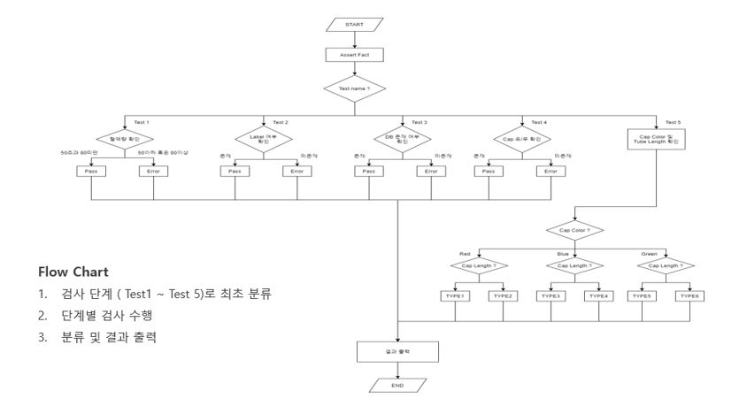
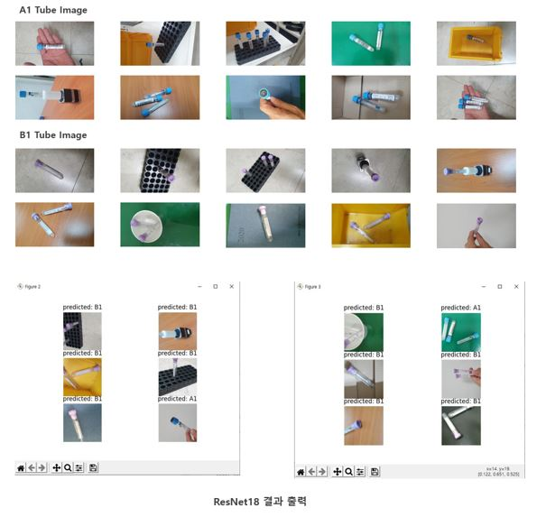
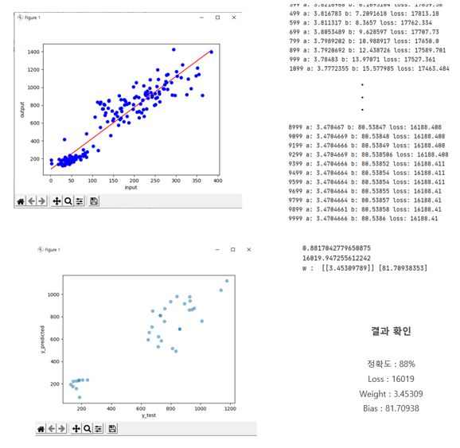

# **산업인공지능 개론 📖**

 
 

## 📝 강의개요 
- 산업 현장 적용을 위한 인공지능 기술의 주요 개념 및 알고리즘을 학습하고 파이썬 기반의 오픈소스 SW를 활용한 실습을 수행하는 실무역량 강화를 위한 교과목이다.

 

## 📌 학습목표 
- 인공지능의 접근방법과 핵심 개념에 대해서 이해한다.
- 최신 인공지능 기술의 산업현장 적용 가능성을 검토하고 설명할 수 있다.
- 인공지능 기술 적용을 위한 오픈 소스를 활용한 실습을 통해 적용 능력을 배양한다.

 

## 📂 과목 진행 내용 

**- `MiniProject1` : [Durable Rules를 이용한 Tube 분류 알고리즘](../MiniProject_1)**

 

**- `MiniProject2` : [ResNet18을 이용한 Tube 이진 분류](../MiniProject_2)**

 

**- `FinalProject` : [선형 회귀 모델을 이용한 병원 방문객 예측](../FinalProject)**

 
