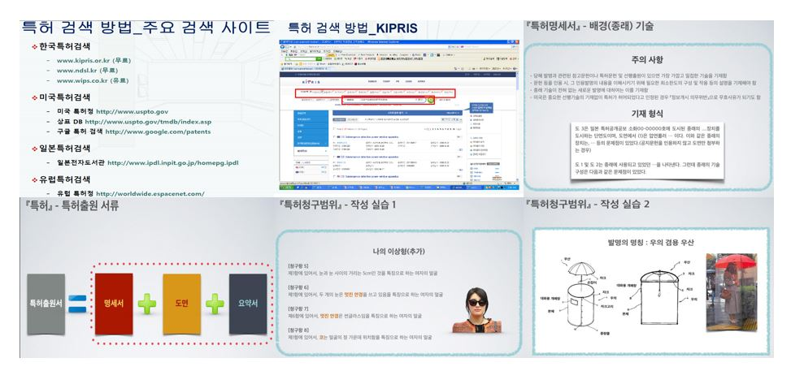

# **어프렌티스 프로젝트 📖**

 
 

## 📝 강의개요 
- 현업의 문제를 해결하기 위한 방법론적 접근방법을 사례를 통해서 학습하여, 해결대상 문제를 식별하고, 문제 해결을 위해 창의적 문제 해결 방식의 발견을 위한 창의적 접근방법을 시도하는 경험을 제공함

 

## 📌 학습목표 
- 산업 인공지능분야에 적합한 주제를 창의력과 융합적 사고를 통하여 최대한 다양하고 많은 주제를 도출하고 이에 대한 문제 해결 방법을 모색할 수 있도록 함.

 

## 📂 과목 진행 내용 

- `(국내)직무발명신고 및 권리승계합의서_양식_김성웅.hwp`
- `(국내출원용)_발명설명서 양식_김성웅.hwp` : 특허 발명설명서
- `기본요약서_김성웅` : 특허 기본요약서
- `명세서_2020254005_김성웅` : 특허명세서
- `특허 찾아보기 20201004_김성웅(VR).hwp` : 관련 선행연구 조사
