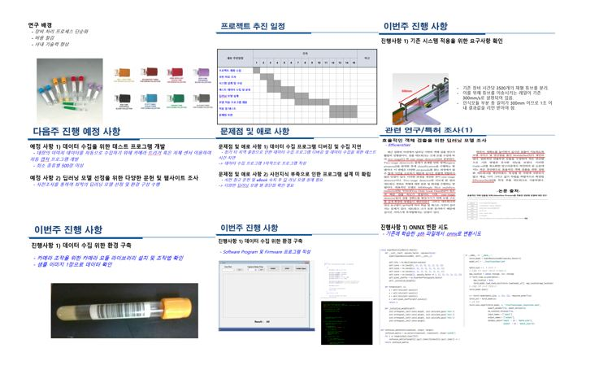

# **지능화 파일럿 프로젝트 📖**

 
 

## 📝 강의개요 
- 한 학기동안 학생들이 자율적으로 주제를 정하여, 독자적으로 설계 및 제작하고 최종적으로 결과물을 발표한다.
- 개인별로 현업과 관련된 주제를 선정하여, 수업에서 배웠던 인공지능 이론을 이용하여 새로운 방법론을 제시하거나 현업에서의 이슈를 해결한다.
- 지능화 캡스톤 프로젝트의 결과물을 개선하여 파일럿 구현을 하고 개선하는 프로젝트를 수행한다.

 

## 📌 학습목표 
- 현업 중에 발생하는 문제를 발굴하고, 솔루션을 제시할 수 있는 문제해결 역량 배양
- 인공지능 관련 프레임워크 활용 역량 강화
- 인공지능 관련 프로그래밍 역량 강화

 

## 📂 과목 진행 내용 

**- `주차별 프로젝트 진행사항 발표`**

 

**- `최종 발표 자료` : [채혈 튜브 영상 분류를 위한 환경 구축 및 딥러닝 모델 설계](./최종발표)**

 
